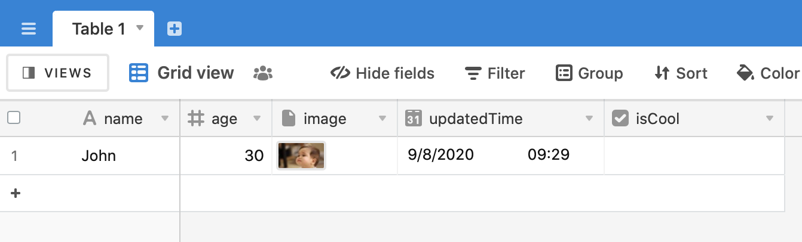

#  Setup

## Requirements

* Xcode 11.7
* Swift 5.2

## Instructions

This examples requires that your Airtable base possesses the following fields:

* `name` : A single-line or multi-line text
* `age` : An integer field
* `isCool`: A checkbox field
* `updatedTime`: A date field
* `image`: An attachment field

## iOS interface

## Output Airtable

